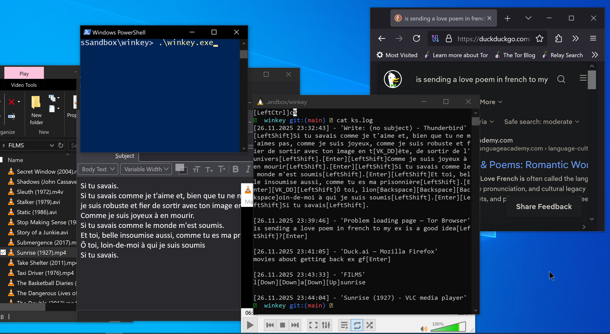

# Winkey Keylogger

A Windows keylogger in C++ using WinAPI, with Unicode support and active window tracking.

---

## Table of Contents

* [1. Screenshot](#1-screenshot)
* [2. Unicode & UTF-8 Output](#2-unicode--utf-8-output)
* [3. Why UTF-8](#3-why-utf-8)
* [4. How We Convert UTF-16 → UTF-8](#4-how-we-convert-utf-16--utf-8)
* [5. Keystroke Logging Logic](#5-keystroke-logging-logic)

  * [5.1 Modifier Keys (Handled Manually)](#51-modifier-keys-handled-manually)
* [6. Mojibake](#6-mojibake)
* [7. Why Japanese IME Input Is Not Captured](#7-why-japanese-ime-input-is-not-captured)
* [8. Dead Keys Problem](#8-dead-keys-problem)
* [9. Alt / AltGr Problem](#9-alt--altgr-problem)
* [10. Window Change Detection](#10-window-change-detection)
* [11. File Output](#11-file-output)
* [12. Output Example](#12-output-example)
* [13. Testing](#13-testing)

  * [13.1 Test Mode](#131-test-mode)
  * [13.2 Using AutoHotkey](#132-using-autohotkey)
* [14. Setting Up a Safe Development Environment](#14-setting-up-a-safe-development-environment)
* [15. Disclaimer](#15-disclaimer)
* [16. Documentation](#16-documentation)

---

## 1. Screenshot

Example of a logged user typing personal messages, including a love poem to their ex:


(Excerpt from 'Si tu savais', by Robert Desnos)

---

## 2. Unicode & UTF-8 Output

Windows APIs return text in **UTF-16** (`std::wstring`) by default. We store all keystrokes, window titles, and other text internally as `std::wstring` to correctly handle all Unicode characters, including accented European letters, Japanese, Chinese, Korean, and surrogate pairs.

Logs are written to a **UTF-8 encoded file** using `std::ofstream` (byte-based). Each UTF-16 string is converted to UTF-8 before writing, ensuring the log is valid Unicode text and can be opened in modern editors.

---

## 3. Why UTF-8

We chose UTF-8 for the log file for several reasons:

* **Cross-editor compatibility:** Modern editors like VS Code, Notepad++, and current Windows Notepad fully support UTF-8.
* **No null bytes:** Unlike UTF-16, UTF-8 avoids embedded null bytes, simplifying text processing.
* **Portability across Windows versions:** Works consistently from Windows 7 onward.
* **Full Unicode coverage:** Any character, including those produced by IMEs or composed with dead keys, is preserved.

This ensures accurate and readable logs across environments.

---

## 4. How We Convert UTF-16 → UTF-8

Instead of deprecated C++17 features like `std::codecvt_utf8`, we rely on **Windows API functions** for conversion:

```cpp
int size = WideCharToMultiByte(
    CP_UTF8, 0, wstr.data(), wstr.size(),
    nullptr, 0, NULL, NULL
);
std::string utf8Str(size, 0);
WideCharToMultiByte(
    CP_UTF8, 0, wstr.data(), wstr.size(),
    utf8Str.data(), size, NULL, NULL
);
logFile << utf8Str;
```

This approach is:

* **Reliable:** Correctly handles surrogate pairs and all valid Unicode sequences.
* **Cross-version compatible:** Works on Windows 7 through Windows 11 without deprecated libraries.
* **IME-safe:** Composed characters (e.g., Japanese input) are preserved after conversion.

By separating the internal representation (`std::wstring`) from the storage format (`std::ofstream` with UTF-8), we avoid mojibake, deprecated API warnings, and platform inconsistencies.

*Reference:* [UTF-8 Everywhere – Windows](https://utf8everywhere.org/#windows)

---

## 5. Keystroke Logging Logic

### 5.1 Modifier Keys (Handled Manually)

* `VK_SHIFT` (uppercase & symbols)
* `VK_CAPITAL` (Caps Lock toggle)
* `VK_CONTROL` / `VK_MENU` (optional for context-aware logging)

```cpp
GetAsyncKeyState(VK_SHIFT) & 0x8000
GetKeyState(VK_CAPITAL) & 0x0001
```

This ensures uppercase letters are detected only when Shift is held or Caps Lock is active.

---

## 6. Mojibake

Opening the log in a non-UTF-8 editor may produce garbled text:

* Older Windows Notepad versions
* `type ks.log` in cmd without `chcp 65001`
* Any ANSI-only tools

Use UTF-8 compatible editors like **VS Code** or **Notepad++**.

---

## 7. Why Japanese IME Input Is Not Captured

Windows IME processes Japanese input in stages and sends messages (`WM_IME_STARTCOMPOSITION`, `WM_IME_COMPOSITION`, `WM_IME_ENDCOMPOSITION`) to the focused window. The low-level keyboard hook only sees raw key codes, not composed text.

---

## 8. Dead Keys Problem

* `ToUnicodeEx` may modify the system keyboard buffer, affecting dead keys.
* Setting **bit 2** in `wFlags` prevents altering the keyboard state:

```cpp
int result = ToUnicodeEx(
    p->vkCode, p->scanCode, keyboardState,
    buffer, TW_KEYSTROKE_MAX, 0x0004, layout
);
```

---

## 9. Alt / AltGr Problem

AltGr is interpreted as LeftCtrl + RightAlt. To translate correctly:

```cpp
if ((keyboardState[VK_RMENU] & 0x80) && (keyboardState[VK_LCONTROL] & 0x80)) {
    keyboardState[VK_LCONTROL] &= ~0x80;
    keyboardState[VK_CONTROL]  &= ~0x80;
}
```

---

## 10. Window Change Detection

Foreground window changes:

```cpp
winEventProc(...) ➜ GetWindowTextW(...) ➜ _windowTitle
```

Logged with timestamp:

```
[DD.MM.YYYY HH:MM:SS] - 'Window Title'
```

---

## 11. File Output

* Log file (`TW_LOGFILE`) is append-only, except in test mode where it is overwritten.
* Keystrokes are flushed immediately using `_logFile.flush()`.
* All logs are UTF-8 encoded for universal readability.

---

## 12. Output Example

```
[26.11.2025 23:32:43] - 'Write: (no subject) - Thunderbird'
[LeftShift]Si tu savais comme je t'aime ... [Enter]

[26.11.2025 23:39:46] - 'Problem loading page — Tor Browser'
is sending a love poem in french to my ex is a good idea[LeftShift]?[Enter]

[26.11.2025 23:41:05] - 'Duck.ai — Mozilla Firefox'
movies about getting back ex gf[Enter]

[26.11.2025 23:43:33] - 'FILMS'
l[Down][Down]a[Down][Up]sunrise

[26.11.2025 23:44:04] - 'Sunrise (1927) - VLC media player'
```

---

## 13. Testing

### 13.1 Test Mode

* Logs raw keystrokes without window titles.
* Produces debug output on console.

### 13.2 Using AutoHotkey

We simulate key presses using **AutoHotkey (AHK)** scripts.

#### Download and Install AutoHotkey

1. [Official website](https://www.autohotkey.com/) → Download & install latest version.

#### Create a Script

1. Right-click Desktop → New → AutoHotkey Script
2. Name it e.g., `test_keys.ahk`
3. Edit and write keystrokes to simulate, then save.

#### Run the Script

* Double-click `.ahk` → green **H** icon appears
* Focus the window to be logged → script types automatically
* Stop: right-click icon → Exit

#### Optional: Compile to EXE

* Right-click `.ahk` → Compile Script → produces standalone `.exe`

---

### Log Testing Script

* Script (`tests/test_keys.ahk` / `.exe`) compares actual log (`ks.log`) to expected output (`expected.txt`).
* Stops at first mismatch and shows position and differing characters.

**Run:**

```powershell
.\winkey.exe -t
test_keys.ahk   # or test_keys.exe
```

---

## 14. Setting Up a Safe Development Environment

We use [windows-cpp-environment](https://github.com/daisvke/windows-cpp-environment) with:

* Visual Studio Build Tools (`cl`, `nmake`)
* PowerShell aliases
* Windows Sandbox (`.wsb`) for safe testing

**Important:** Run experimental programs inside the sandbox only.

---

## 15. Disclaimer

Educational purposes only. Unauthorized use may violate privacy laws. Use responsibly.

---

## 16. Documentation

* [SetWindowsHookExA (Microsoft Learn)](https://learn.microsoft.com/fr-fr/windows/win32/api/winuser/nf-winuser-setwindowshookexa)
* [TranslateMessage (Microsoft Learn)](https://learn.microsoft.com/en-gb/windows/win32/api/winuser/nf-winuser-translatemessage)
* [Using Messages and Message Queues (Microsoft Learn)](https://learn.microsoft.com/en-gb/windows/win32/winmsg/using-messages-and-message-queues)
* [GetAsyncKeyState (winuser.h)](https://learn.microsoft.com/en-au/windows/win32/api/winuser/nf-winuser-getasynckeystate)
* [Keylogger Tutorial (Synacktiv)](https://www.synacktiv.com/publications/writing-a-decent-win32-keylogger-13)
* [Virtual Key Codes (Windows Learn)](https://learn.microsoft.com/en-us/windows/win32/inputdev/virtual-key-codes)
* [Keyboard input on Windows, Part II](https://metacpan.org/dist/UI-KeyboardLayout/view/lib/UI/KeyboardLayout.pm#Keyboard-input-on-Windows,-Part-II:-The-semantic-of-ToUnicode%28%29)
* [UTF-8 Everywhere – Windows](https://utf8everywhere.org/#windows)

---

## TO DO

* Check dead keys behavior on < Windows 10
* Memory leak checks (Windbg, sanitizer)
