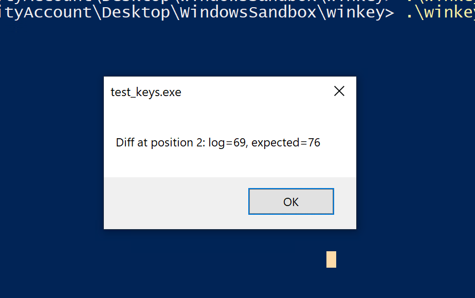

# Winkey Keylogger

A Windows keylogger in C++ using WinAPI, with Unicode support and active window tracking.

---

## Table of Contents

* [1. Screenshot](#1-screenshot)
* [2. Features](#2-features)
* [3. Build & Execution Instructions](#3-build--execution-instructions)
* [4. How It Works](#4-how-it-works)

  * [4.1 Keystroke Logging Logic](#41-keystroke-logging-logic)
  * [4.2 Modifier Keys (Handled Manually)](#42-modifier-keys-handled-manually)
* [5. Unicode & wchar_t Support](#5-unicode--wchart-support)

  * [5.1 Capturing UTF-8 Characters](#51-capturing-utf-8-characters)
  * [5.2 Mojibake](#52-mojibake)
  * [5.3 Why we won’t get Japanese characters from the keyboard hook](#53-why-we-wont-get-japanese-characters-from-the-keyboard-hook)
* [6. Dead Keys Problem](#6-dead-keys-problem)
* [7. Alt / AltGr Problem](#7-alt--altgr-problem)
* [8. Window Change Detection](#8-window-change-detection)
* [9. File Output](#9-file-output)
* [10. Output Example](#10-output-example)
* [11. Testing](#11-testing)

  * [11.1 Test Mode](#111-test-mode)
  * [11.2 Using AutoHotkey](#112-using-autohotkey)
* [12. Setting Up a Safe Development Environment](#12-setting-up-a-safe-development-environment)
* [13. Disclaimer](#13-disclaimer)
* [14. Documentation](#14-documentation)

---

## 1. Screenshot


---

## 2. Features

* Logs all keystrokes globally.
* Detects and logs active window title changes.
* Handles uppercase and shifted input.
* Correctly captures **Ctrl-modified characters** (e.g., `Ctrl+A`, `Ctrl+Alt+key`).
* Supports **Alt code character input** (e.g., `#[|\]`) without corrupting the keyboard state.
* Properly processes **dead keys** (e.g., `^` + `e` → `ê`) while preserving the user's keyboard state.
* Writes logs to a UTF-16LE encoded `.log` file.
* Limits repeated key output: when the maximum repetition count is reached, logging stops for that key.
* Includes a **test mode** (`-t`) that simplifies debugging and comparing expected keystrokes with actual results.

---

## 3. Build & Execution Instructions

> nmake

and the usual:

> nmake clean<br />
> nmake fclean<br />
> nmake re

Run with:

```powershell
# '-t' is for the test mode
.\winkey.exe [-t]
```

---

## 4. How It Works

### 4.1 Keystroke Logging Logic


[Source](https://www.synacktiv.com/publications/writing-a-decent-win32-keylogger-23)

```cpp
ToUnicodeEx(...)  // Converts VK code + scan code to readable character
```

### 4.2 Modifier Keys (Handled Manually)

* `VK_SHIFT` (for uppercase & symbols)
* `VK_CAPITAL` (Caps Lock toggle)
* `VK_CONTROL` / `VK_MENU` (optional for context-aware logging)

The logger uses:

```cpp
GetAsyncKeyState(VK_SHIFT) & 0x8000
GetKeyState(VK_CAPITAL) & 0x0001
```

Ensuring uppercase characters are detected only when:

* Shift is held
* Caps Lock is toggled (for alphabetic keys)

---

## 5. Unicode & `wchar_t` Support

### 5.1 Capturing UTF-8 Characters

This project uses `wchar_t` and `std::wofstream` to correctly handle multilingual keyboard input (including Japanese, Chinese, Korean, and accented European characters).

```cpp
// Write wchar_t data (Unicode) as UTF-8 to the log file
_logFile.imbue(std::locale(std::locale(), new std::codecvt_utf8<wchar_t>));
```

### 5.2 Mojibake

Opening the log in a non-UTF-8 editor may produce garbled text:

* Older Windows Notepad
* `type logfile.txt` in cmd without `chcp 65001`
* Any ANSI-only tool

Use UTF-8 compatible tools like **Notepad++** or **VS Code**.

### 5.3 Why we won’t get Japanese characters from the keyboard hook

Windows IME processes Japanese input in stages and sends messages (`WM_IME_STARTCOMPOSITION`, `WM_IME_COMPOSITION`, `WM_IME_ENDCOMPOSITION`) to the focused window. The low-level keyboard hook only sees raw key codes, not composed text.

---

## 6. Dead Keys Problem

* `ToUnicodeEx` may modify the system keyboard buffer, affecting dead keys.
* Setting **bit 2** in `wFlags` prevents altering the keyboard state:

```cpp
int result = ToUnicodeEx(
    p->vkCode,
    p->scanCode,
    keyboardState,
    buffer,
    TW_KEYSTROKE_MAX,
    0x0004, // Set bit 2 → do not change keyboard state
    layout
);
```

---

## 7. Alt / AltGr Problem

* AltGr is interpreted as LeftCtrl + RightAlt.
* Detect AltGr and clear LeftCtrl to translate correctly:

```cpp
if ((keyboardState[VK_RMENU] & 0x80) && (keyboardState[VK_LCONTROL] & 0x80)) {
    keyboardState[VK_LCONTROL] &= ~0x80;
    keyboardState[VK_CONTROL]  &= ~0x80;
}
```

---

## 8. Window Change Detection

Foreground window changes:

```cpp
winEventProc(...) ➜ GetWindowTextW(...) ➜ _windowTitle
```

Logged with timestamp:

```
[DD.MM.YYYY HH:MM:SS] - 'Window Title'
```

---

## 9. File Output

* Log file (`TW_LOGFILE`) is append-only except in test mode where the file is overwritten.
* Keystrokes are flushed immediately using `_logFile.flush()`.

---

## 10. Output Example

```
[26.11.2025 23:32:43] - 'Write: (no subject) - Thunderbird'
[LeftShift]Si tu savais comme je t'aime et, bien que tu ne m'aimes pas, comme je suis joyeux, comme je suis robuste et fier de sortir avec ton image en t[VK_DD]ête, de sortir de l'univers[LeftShift].[Enter][LeftShift]Comme je suis joyeux à en mourir[LeftShift].[Enter][LeftShift]Si tu savais comme le monde m'est soumis[LeftShift].[Enter][LeftShift]Et toi, belle insoumise aussi, comme tu es ma prisonnière[LeftShift].[Enter][VK_DD][LeftShift]Ô toi, lion[Backspace][Backspace][Backspace]oin-de-moi à qui je suis soumis[LeftShift].[Enter][LeftShift]Si tu savais[LeftShift].

[26.11.2025 23:39:46] - 'Problem loading page — Tor Browser'
is sending a love poem in french to my ex is a good idea[LeftShift]?[Enter]

[26.11.2025 23:41:05] - 'Duck.ai — Mozilla Firefox'
movies about getting back ex gf[Enter]

[26.11.2025 23:43:33] - 'FILMS'
l[Down][Down]a[Down][Up]sunrise

[26.11.2025 23:44:04] - 'Sunrise (1927) - VLC media player'
```

---

## 11. Testing

### 11.1 Test Mode

* No window titles — only raw keystrokes
* Produces debug output on console

### 11.2 Using AutoHotkey

We can simulate key presses using **AutoHotkey (AHK)** scripts.

#### Download and Install AutoHotkey

1. Go to the official website: [https://www.autohotkey.com/](https://www.autohotkey.com/)
2. Click **Download** and install the latest **current version**.
3. The installer will guide you through setup.

#### Create a Script

1. Right-click on your Desktop (or any folder).
2. Select **New → AutoHotkey Script**.
3. Give it a name, e.g., `test_keys.ahk`.
4. Right-click the file → **Edit Script**. It will open in Notepad.

#### Write Your Key Simulation Script

Write the keystrokes you want the logger to capture. Save the script.

#### Run the Script

1. Double-click your `.ahk` file.
2. A green **H** icon appears in the system tray — script is running.
3. Focus the window you want to test (or your logger) and let the script type automatically.

#### Stop the Script

* Right-click the green H icon → **Exit**.

#### Optional: Compile to EXE

* Right-click the `.ahk` file → **Compile Script**.
* Produces a standalone `.exe` you can run without installing AHK.

---

### Our Log Testing Script

Our script (`tests/test_keys.ahk` / `tests/test_keys.exe`) compares the program’s output log (`ks.log`) with an expected string in `expected.txt`.

#### How it works

1. Run the program in **test mode** → creates `ks.log` without window titles.
2. The script reads both files, removes newlines, and compares character by character.
3. Stops at the first mismatch and shows **position** and differing characters.
4. If all matches, shows *“Log matches expected string!”*.

<p align="center">

</p>

**Notes:**

* `#` in AutoHotkey is a special modifier for `Win` key, not a literal `#`.
* On VSCode, `Ctrl+P > :1:[POSITION]` jumps to position in a string.

**Files:**

* `ks.log` – actual logged keys
* `expected.txt` – expected keys
* `test_keys.ahk` – test script
* `test_keys.exe` – compiled test binary

**Run:**

```powershell
# Run the keylogger first in test mode
.\winkey.exe -t

# Then run the test script:
test_keys.ahk
# Or (no need to install AHK):
test_keys.exe
```

---

## 12. Setting Up a Safe Development Environment

Use [windows-cpp-environment](https://github.com/daisvke/windows-cpp-environment) for:

* Visual Studio Build Tools with `cl` and `nmake`
* PowerShell aliases
* Windows Sandbox configuration (`.wsb`) for safe testing

**Important:** Run experimental programs inside the sandbox only.

---

## 13. Disclaimer

Educational purposes only. Unauthorized use may violate privacy laws. Use responsibly.

---

## 14. Documentation

* [SetWindowsHookExA (Microsoft Learn)](https://learn.microsoft.com/fr-fr/windows/win32/api/winuser/nf-winuser-setwindowshookexa)
* [TranslateMessage (Microsoft Learn)](https://learn.microsoft.com/en-gb/windows/win32/api/winuser/nf-winuser-translatemessage)
* [Using Messages and Message Queues (Microsoft Learn)](https://learn.microsoft.com/en-gb/windows/win32/winmsg/using-messages-and-message-queues)
* [GetAsyncKeyState (winuser.h)](https://learn.microsoft.com/en-au/windows/win32/api/winuser/nf-winuser-getasynckeystate)
* [Keylogger Tutorial (Synacktiv)](https://www.synacktiv.com/publications/writing-a-decent-win32-keylogger-13)
* [Virtual Key Codes (Windows Learn)](https://learn.microsoft.com/en-us/windows/win32/inputdev/virtual-key-codes)
* [Keyboard input on Windows, Part II](https://metacpan.org/dist/UI-KeyboardLayout/view/lib/UI/KeyboardLayout.pm#Keyboard-input-on-Windows,-Part-II:-The-semantic-of-ToUnicode%28%29)

## TO DO
- check dead keys behavior on < w10
- leak checks: windbg?
