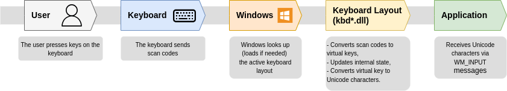

# Winkey Keylogger
A Windows keylogger in C++ using WinAPI, with Unicode support and active window tracking.

---

## TODO
- check dead keys behavior on < w10
- readme: disable errors mode (test mode)
- reamde: replace "this is a test"
- add ref to win-cpp-env
- leak checks: windbg?

## Features

- Logs all keystrokes globally.
- Detects and logs active window title changes.
- Handles uppercase and shifted input (e.g., `A` vs `a`, `!` vs `1`).
- Writes logs to a UTF-16LE encoded `.log` file.
- When the maximum key repetition count is reached, we stop printing it.

---

## Build Instructions

> nmake

and the usual:
> nmake clean<br />
> nmake fclean<br />
> nmake re

---

## How It Works

### **Keystroke Logging Logic**


[Source](https://www.synacktiv.com/publications/writing-a-decent-win32-keylogger-23)

```cpp
ToUnicodeEx(...)  // Converts VK code + scan code to readable character
```

---

#### Modifier Keys (Handled Manually)

* `VK_SHIFT` (for uppercase & symbols)
* `VK_CAPITAL` (Caps Lock toggle)
* `VK_CONTROL` / `VK_MENU` (optional for context-aware logging)

The logger uses:

```cpp
GetAsyncKeyState(VK_SHIFT) & 0x8000
GetKeyState(VK_CAPITAL) & 0x0001
```

This ensures uppercase characters are detected only when:

* Shift is held
* Caps Lock is toggled (for alphabetic keys)

---

### Unicode & `wchar_t` Support
---
#### Capturing UTF-8 Characters
This project uses `wchar_t` and `std::wofstream` to correctly handle multilingual keyboard input (including Japanese, Chinese, Korean, and accented European characters).

By default, `wofstream` does **not** write UTF-8.
To ensure that all captured characters—such as Japanese (日本語) or accented letters (é, ñ, ê)—are written correctly, the log file stream is explicitly imbued with a UTF-8 codec:

```cpp
// Write wchar_t data (Unicode) as UTF-8 to the log file
_logFile.imbue(std::locale(std::locale(), new std::codecvt_utf8<wchar_t>));
```

This guarantees that every wide character produced by `ToUnicodeEx()` is saved in proper UTF-8 encoding, making the log file readable across all platforms and editors.

---

#### Mojibake
If you open the file in a non-UTF-8 compatible editor like:
  - Windows Notepad (older versions)
  - `type logfile.txt` in a Windows console with non-Unicode codepage
  - Any tool that assumes ANSI encoding

You’ll see mojibake like `ã‚` instead of the intended Japanese kana.

=> Open the log file in a proper UTF-8-aware viewer:
  - **Notepad++** (select `Encoding → UTF-8`)
  - **Visual Studio Code**
  - **`more logfile.txt`** from `cmd` after running `chcp 65001`, etc...

---

#### Why we won’t get Japanese characters from the keyboard hook

When a user types Japanese, input is usually processed through the Windows IME (Input Method Editor). Unlike direct keyboard input, the IME composes text in stages and sends it through different message types such as:
- WM_IME_STARTCOMPOSITION
- WM_IME_COMPOSITION
- WM_IME_ENDCOMPOSITION<br />

Those are sent to the focused window, not to the low-level keyboard hook we’re using.<br />
That means our hook never sees the resulting composed Japanese text — it only sees raw key codes before conversion.

---

### Dead Keys Problem

#### The Problem

* We use the `ToUnicodeEx` function to translate virtual-key codes into their corresponding Unicode characters.

* However, as stated in the [Microsoft Learn documentation](https://learn.microsoft.com/en-gb/windows/win32/api/winuser/nf-winuser-tounicodeex):

  > As ToUnicodeEx translates the virtual-key code, it also changes the state of the kernel-mode keyboard buffer.
  > This state-change affects dead keys, ligatures, Alt+Numeric keypad key entry, and so on.

* Because of this behavior, `ToUnicodeEx` modifies the system keyboard buffer used by the active application.

* As a result, when our hook calls `ToUnicodeEx` for logging purposes, it can interfere with the user’s actual input — producing odd results such as `^^e` instead of `ê`.

#### The Solution

* The same documentation notes that the `wFlags` parameter of `ToUnicodeEx` controls its behavior. Specifically:

  > If bit 2 is set, the keyboard state is not changed (Windows 10, version 1607 and newer).

* Therefore, by setting **bit 2** in `wFlags`, we can safely translate the key without altering the system keyboard state.

---

### Alt / AltGr Problem

#### The Problem

* On many international keyboard layouts, the **AltGr** key is implemented internally as a combination of **LeftCtrl + RightAlt**.

* When we intercept keystrokes with a low-level keyboard hook and translate them using `ToUnicodeEx`, we often read the keyboard state with `GetKeyboardState`.

* If both `VK_LCONTROL` and `VK_RMENU` (RightAlt) are reported as pressed at the same time, Windows interprets this as **Ctrl + Alt** rather than the single logical modifier **AltGr**.

* The result is that `ToUnicodeEx` receives a modifier state equivalent to pressing **Ctrl + Alt + <Key>**, which typically has **no printable output**.
  Consequently, `ToUnicodeEx` returns `0`, and our logger gets an incorrect value for the next pressed key.

#### The Solution

* Before calling `ToUnicodeEx`, detect the AltGr condition and normalise the modifier state:

  ```cpp
  if ((keyboardState[VK_RMENU] & 0x80) && (keyboardState[VK_LCONTROL] & 0x80)) {
      // AltGr detected – clear LeftCtrl so ToUnicodeEx treats it as AltGr
      keyboardState[VK_LCONTROL] &= ~0x80;
      keyboardState[VK_CONTROL]  &= ~0x80;
  }
  ```

* This small adjustment ensures that `ToUnicodeEx` sees the proper AltGr modifier instead of a generic Ctrl + Alt combination, allowing it to return the correct printable character.

* The change does not affect normal Ctrl + Alt shortcuts or other modifier keys; it only corrects the transient overlap that occurs with AltGr.

* As with the dead-key workaround, this fix isolates our hook’s translation logic from the user’s live keyboard state, preventing incorrect or missing character translations.

```cpp
int result = ToUnicodeEx(
    p->vkCode,
    p->scanCode,
    keyboardState,
    buffer,
    TW_KEYSTROKE_MAX,
    0x0004, // Set bit 2 → do not change keyboard state
    layout
);
```

* This prevents `ToUnicodeEx` from consuming or modifying dead keys, allowing composed characters like “ê” to appear correctly while still logging them accurately.

---

### **Window Change Detection**

Whenever a foreground window changes:

```cpp
winEventProc(...) ➜ GetWindowTextW(...) ➜ _windowTitle
```

Logged with timestamp in the following format:

```
[DD.MM.YYYY HH:MM:SS] - 'Window Title'
```

---

### **File Output**

* The log file (`TW_LOGFILE`) is opened in append mode.
* Each keystroke is immediately flushed to disk using `_logFile.flush()`.

---

## Output Example

```
[01.06.2025 10:15:42] - 'Visual Studio Code'
This is a test.
```

---

## Testing
We can simulate key presses using **AutoHotkey (AHK)** scripts.<br />
Running **AutoHotkey (AHK)** is very straightforward. Here’s a step-by-step guide to get you started:

### Download and Install AutoHotkey to simulate keystrokes

1. Go to the official website: [https://www.autohotkey.com/](https://www.autohotkey.com/)
2. Click **Download** and install the latest **current version**.
3. The installer will guide you through setup.

#### Create a Script
1. Right-click on your Desktop (or any folder).
2. Select **New → AutoHotkey Script**.
3. Give it a name, e.g., `test_keys.ahk`.
4. Right-click the file → **Edit Script**. It will open in Notepad.

#### Write Your Key Simulation Script

#### Run the Script
1. Double-click your `.ahk` file.
2. You will see a green H icon appear in the system tray — the script is running.
3. Focus the window you want to test (or your logger) and let the script type automatically.

#### Stop the Script
* Right-click the green H icon in the system tray → **Exit**.

#### Optional: Compile to EXE
* Right-click the `.ahk` file → **Compile Script**.
* This produces a standalone `.exe` you can run on any Windows PC without installing AHK.

---

### Our Log Testing Script
Our script (`tests/test_keys.ahk`, or `tests/test_keys.exe` for the compiled version) compares the program’s output log (`ks.log`) with an expected string in `expected.txt`.

### How it works

1. Run the program in **test mode** → creates `ks.log`.
2. The script reads both files, removes newlines, and compares them **character by character**.
3. If a mismatch is found, it stops there and shows the **position** and the differing characters.
4. If all matches, it shows *“Log matches expected string!”*.

### Notes
- In AutoHotkey, the `#` character is a special modifier symbol meaning `Win (Windows key)`, not a literal `#`. Don't use it in your tests.
- On VSCode, `Ctrl+P > :1:[POSITION]` lets you get to the given position on a string.

### Files

* `ks.log` – actual logged keys
* `expected.txt` – expected keys
* `test_keys.ahk` – test script
* `test_keys.exe` – test binary

### Run

```powershell
# Run the keylogger first
Winkey.exe --test

# Then tun the test script by double-clicking:
test_keys.ahk
# Or (no need to install AHK):
test_keys.exe
```

---

## Disclaimer

This software is for **educational purposes only**. Unauthorized use of keyloggers may violate privacy laws. Use responsibly.

## Documentation
- [SetWindowsHookExA function (Microsoft Learn)](https://learn.microsoft.com/fr-fr/windows/win32/api/winuser/nf-winuser-setwindowshookexa)
- [TranslateMessage function (Microsoft Learn)](https://learn.microsoft.com/en-gb/windows/win32/api/winuser/nf-winuser-translatemessage)
- [Using Messages and Message Queues (Microsoft Learn)](https://learn.microsoft.com/en-gb/windows/win32/winmsg/using-messages-and-message-queues)
- [GetAsyncKeyState function (winuser.h)](https://learn.microsoft.com/en-au/windows/win32/api/winuser/nf-winuser-getasynckeystate)
- [Keylogger Tutorial (Synacktiv)](https://www.synacktiv.com/publications/writing-a-decent-win32-keylogger-13)
- [Virtual Key Codes (Windows Learn)](https://learn.microsoft.com/en-us/windows/win32/inputdev/virtual-key-codes)
- [Keyboard input on Windows, Part II: The semantic of ToUnicode()](https://metacpan.org/dist/UI-KeyboardLayout/view/lib/UI/KeyboardLayout.pm#Keyboard-input-on-Windows,-Part-II:-The-semantic-of-ToUnicode())
